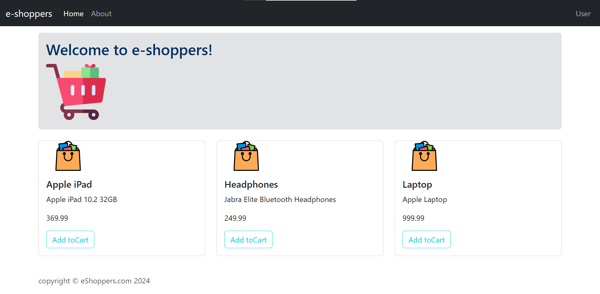
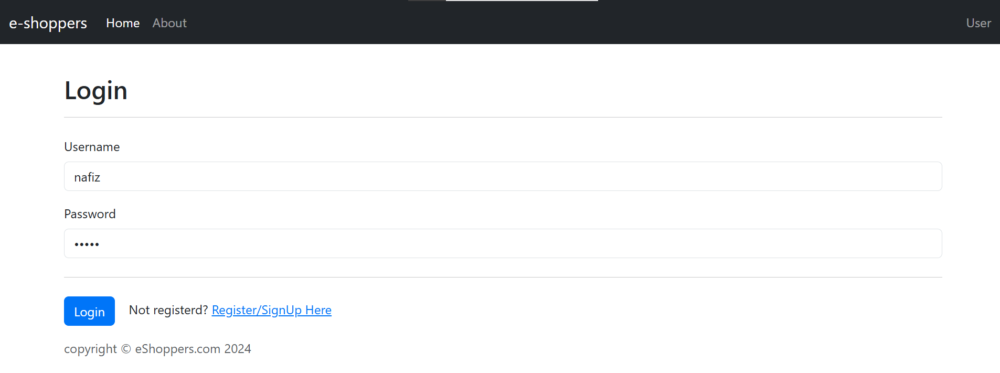
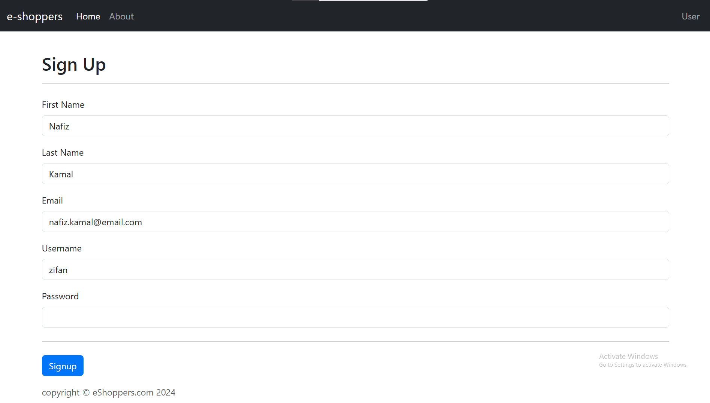

# myEshoppers

myEshoppers is an e-commerce application built primarily using Java, HTML, and CSS. This project aims to provide a seamless online shopping experience to users while showcasing the integration of various web technologies.

## Table of Contents
- [Features](#features)
- [Screenshots](#screenshots)
- [Technologies Used](#technologies-used)
- [Installation](#installation)
- [Usage](#usage)
- [Contributing](#contributing)
- [License](#license)

## Features
- User Registration and Authentication
- Product Browsing
- Shopping Cart
- Order Management
- Admin Dashboard

## Screenshots




## Technologies Used
- **Java**: Backend development
- **HTML**: Structure of the web pages
- **CSS**: Styling of the web pages

## Installation
To get a local copy up and running follow these simple steps:

### Prerequisites
- JDK 8 or higher
- Maven

### Clone the repository
```bash
git clone https://github.com/nafizkamal11/myEshoppers.git
cd myEshoppers
```
